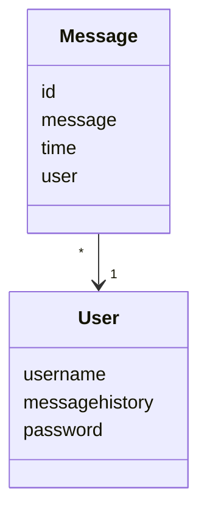

# Arkkitehtuurikuvaus

## Rakenne

Ohjelman rakenne on hajautettu vastuualueisiin. Esimerkiksi _UI_ on oma entiteetti, joka on vuorovaikutuksessa _chat_services_ kanssa, joka sisältää suurimman osan sovelluslogiikasta, kuten viestien lähettämisen ja lukemisen. _Chat_services_ taas on vuorovaikutuksessa luokkiin _User_ ja _Message_, sekä _dataparser_ iin, joka on vastuussa datan tallentamisesta ja lukemisesta.

## Käyttöliittymä

Käyttäliittymään kuuluu kaksi näkymää:

- Kirjautumisruutu, jossa voi syöttää tunnuksen ja salasanan tai luoda tilin
- Chat-ikkuna, jossa kirjautumisen jälkeen voi lukea vanhoja viestejä ja kirjoittaa uusia.

Näiden lisäksi sovelluksessa on erilaisia ponnahdusikkonoita esimerkiksi tilanteeseen, jossa salasana on väärin.

Nämä ovat toteutettu omiin UI-luokkiinsa, jotka lähettävät tietoa _chatservices_ palvelulle.

Kun käyttäjä kirjautuu, hän pääsee chat-näkymään.

Kun käyttäjä lähettää viestin, chat-ikkuna päivittyy, ja uusi viesti tulee näkyviin.

## Sovelluslogiikka

Sovellus käyttää luokkia User ja Message. [User](https://github.com/ot_harjoitustyo/blob/master/src/user.py) ja [Message](https://github.com/ot_harjoitustyo/blob/master/src/chat_message.py).

 
Chat_service on vastuussa sovelluksen logiikalta. UI lähettää chat_servicen metodeille erilaisia parametreja, joita chat_services käyttää. Näitä ovat:
 
- `username_exists(username)`
- `add_user(name, password)`
- `check_log_in(username,passowrd)`
- `create_account(username,password`
- `send_message(message)`

## Tietojen pysyväistallennus

Luokka dataparser on vastuussa datan tallentamisesta. Data tallennetaan .json tiedostoihin, ja ohjelma käyttää pandas-moduulia .json-tiedostojen käsittelyyn.

### Tiedostot

Sovellus käyttää kahta tallennustiedostoa: accounts.json ja messagehistory.json. 

accounts.json sisältää käyttäjänimet ja salasaant
messagehistory.json sisältää chattiin lähetetyt viestit 

## Päätoiminnallisuudet

### Ennen kirjautumista

Kaksi kenttää ja kaksi nappia: [TEHTY]

Kentät: Tunnus ja salasana [TEHTY]
Napit: Kirjaudu ja Luo tunnus [TEHTY]

Luo tunnus: [TEHTY]
- Käyttäjätunnuksen luominen ja salasanan valitseminen [TEHTY]

tai

- Käyttäjä voi kirjautua järjestelmään [TEHTY]
    - Jos tunnus ja salasana löytyy tietokannasta, käyttäjä pääsee chat-näkymään. [TEHTY]

### Kirjautumisen jälkeen

- Käyttäjä voi lukea vanhoja viestejä joita on lähetetty. [TEHTY]
- Ruudun alaosassa tyhjä kenttä, johon kirjottamalla ja painamalla enteriä viesti lähtee muille nähtäväksi. [TEHTY]
